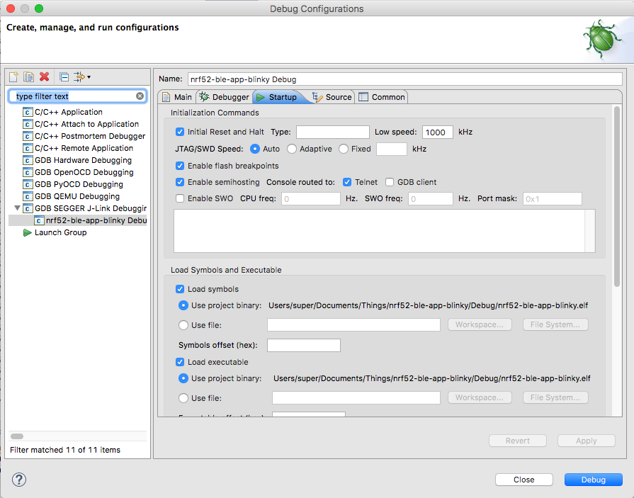

# Homebrew를 이용한 개발환경 설치
* homebrew는 MacOS 환경의 패키지매니저이다.
* homebrew 패키지매니저를 사용하면, sudo 를 남발하지 않아도 되는 등, 다른 패키지매니저에 비해 다양한 장점이 있다.
* homebrew 패키지매니저에는 이미 많은 formula들이 제공되므로, 가급적 패키지설치시에는 homebrew를 사용하자.
* 기존에 제공하지 않는 패키지 설치가 필요한 경우에는 자체적으로 tap(formula 리파지토리)을 만들어서 사용할 수 있다.
## Prerequisite
* [homebrew](https://brew.sh)
  - homebrew를 설치한다. 
  - $ brew 를 실행해보면 기존 설치 여부를 확인할 수 있다.(이미 설치되어 있으면 당연히 SKIP.)
```
/usr/bin/ruby -e "$(curl -fsSL https://raw.githubusercontent.com/Homebrew/install/master/install)"
```
* [homebrew cask](https://caskroom.github.io)
  - homebrew의 확장 cask를 설치한다.
  - $ brew cask 를 실행해보면 기존 설치 여부를 확인할 수 있다.(이미 설치되어 있으면 당연히 SKIP.)
```
$ brew tap caskroom/cask
```
* Java
  - 기존에 Java가 설치되어 있지 않거나, 버전이 낮은 경우에 설치한다.
```
$ brew cask install java
```
## Installation
* [add homebrew repository(hatiolab/rtls)](https://github.com/hatiolab/homebrew-RTLS)
  - RTLS 설치용으로 제작한 hatiolab/rtls 를 tap으로 추가한다.
  - hatiolab/rtls tap에서는 nRF5 관련한 SDK와 Command Line Tools를 설치할 수 있는 brew formula를 제공한다.
  - 또한, hatiolab/rtls tap에서는 GNU MCU Plugin이 설치된 이클립스 IDE를 설치할 수 있는 brew formula를 제공한다.
```
$ brew tap hatiolab/rtls
```
* [GNU MCU Eclipse IDE](https://github.com/gnu-mcu-eclipse/org.eclipse.epp.packages/releases)
  - GNU MCU 플러그인이 설치된 이클립스 IDE를 한번에 설치한다.
  - 설치후에 Application 에 'Eclipse MCU' 어플리케이션이 설치된다.
  - 이 IDE에서 Firmware 프로젝트를 개발하게 된다.
```
$ brew cask install gnu-mcu-eclipse-ide
```
* ARM Embedded Toolchain
  - ARM용 gcc 등 GNU 툴을 설치한다.
  - MacOS 환경에 ARM용 Cross Compile 환경을 구축한다.
  - 설치가 완료되면, /usr/local/bin 디렉토리 아래 'arm-none-eabi-' prefix를 가진 ARM용 Cross Compile 툴들이 설치된다.
  - 따라서, Cross Compile 환경의 Root는 /usr/local 디렉토리가 된다.
```
$ brew cask install gcc-arm-embedded
```
* nRF5x Command Line Tools
  - nRF5x용 명령라인툴을 설치한다.
  - 설치하면, mergehex, nrfjprog 가 /usr/local/bin에 설치되어 쉘에서 바로 실행할 수 있게 된다. (별도 path 설정작업 불필요함.)
```
$ brew install nrf5x-cli
```
### nRF5 SDK
  - nRF5용 SDK를 다운로드 받아서 설치한다.
  - 설치가 완료되면, /usr/local/opt/nrf5-sdk 폴더에 nRF5용 SDK가 설치된다.
```
$ brew install nrf5-sdk
```
  - 설치 과정에서 /usr/local/opt/nrf5-sdk/components/toolchain/gcc/Makefile.posix 의 내용이 자동 수정된다.
```
GNU_INSTALL_ROOT := /usr/local
GNU_VERSION := 6.3.1
GNU_PREFIX := arm-none-eabi
```
### SEGGER JLink 설치
* [Segger Software and documentation pack for Mac OS X](https://www.segger.com/downloads/jlink)

## Sample Application 설치해서 테스트
* [MacOS GNU MCU Eclipse IDE 환경 개발 샘플 어플리케이션 I](https://github.com/heartyoh/nrf52-sample)
  * Nordic blinky 예제를 Eclipse IDE에 맞게 샘플 작업하였슴.
* [MacOS GNU MCU Eclipse IDE 환경 개발 샘플 어플리케이션 II](https://github.com/heartyoh/nrf52-ble-app-blinky)
  * Nordic experimental_ble_app_blinky 예제를 Eclipse IDE에 맞게 샘플 작업하였슴.
  * [nRF Blinky Web App](https://nordicsemiconductor.github.io/nrf5-physical-web/projects/nRF-Blinky/)을 브라우저에서 실행하여 테스트할 수 있음.
* 빌드 및 다운로드 방법
  * 프로젝트를 체크아웃 받은 후, Eclipse MCU 에서 'import'=>'Existing Projects into Workspace' 로 프로젝트를 추가하고 빌드
  * Debug 또는 Release 폴더에 nrf52-sample.hex 파일이 만들어진 것을 확인
  * DK 보드와 USB로 연결하고, Build Targets => flash 를 더블클릭하면, DK보드에 Firmware가 다운로드됨
  * 

* 디버깅 방법 (Nordic Device Pack 설치가 잘 안되서인지, 디버깅시 Breakpoint 처리가 잘 되지 않지만, ...)
  * [디버깅 방법 참조 문서](https://devzone.nordicsemi.com/tutorials/7/)의 Setting up a project for debugging in Eclipse 부분 참조해서 설정.
  * 프로젝트 ROOT 우클릭, Debug As => Debug Configuration
  * 
  
  * GDB SEGGER J-Link Debugging 더블클릭
  * Main 탭에서 C/C++ Application 을 설정
  * 
  
  * Debugger 탬에서 Device name을 'nRF52832-xxaa'로 설정하고, Other options 에서 -nogui 옵션을 제거
  * 
  
  * Startup 탬에서 Enable SWO옵션을 uncheck
  * 
  
  * Apply 버튼, Debug 버튼.
* 참고자료
  * [The complete nRF52 Mac development tutorial](http://www.novelbits.io/nrf52-mac-development-tutorial/)
  * [Discover Nordic Semi nRF52832 with Eclipse](https://www.disk91.com/2017/technology/hardware/discover-nordic-semi-nrf52832/)
